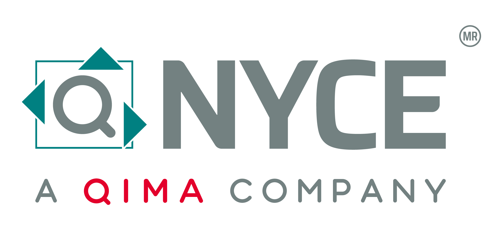

# ¿Qué es NYCE? 
 

Normalización y Certificación NYCE, nace como un Organismo Nacional de Normalización (ONN) en la industria Electrónica, Telecomunicaciones y Tecnologías de Información lo que consolidó su liderazgo en la evaluación de la conformidad en materia de Normas Oficiales Mexicanas (NOM) y Normas Mexicanas (NMX) para diversas industrias.

# ¿Qué hace NYCE?
 

Desde lo más sencillo como la seguridad alimentaria, hasta lo más complejo como productos de telecomunicaciones, certificamos prácticamente a todas las industrias y sectores.

# Misión y visión de NYCE.
 

#### **Misión:**

Desarrollar estándares y evaluar la conformidad, para facilitar a nuestros usuarios el acceso a mercados, en forma ágil y transparente, garantizando la seguridad del consumidor, su salud, el cuidado del medio ambiente y la protección de las vías generales de comunicación.

 

#### **Visión:**

Ser una organización líder con presencia internacional, reconocida en América Latina por sus buenas prácticas y por prestar servicios de excelencia en Evaluación de la Conformidad con base en normas, regulaciones y otros esquemas de cumplimiento, manteniendo un sano crecimiento.

# Origenes de NYCE
 

Por más de 25 años,  NYCE  ha permanecido como un aliado estratégico en el mercado brindando SEGURIDAD Y CONFIANZA a la industria y los consumidores.  Con el respaldo de un amplio portafolio de servicios enfocado a cubrir las necesidades de distintos rubros económicos, NYCE avanza no solo a nivel nacional sino también internacional.

# Reconocimientos de NYCE.
 

Ha sido galardonados por CONCAMIN en cuatro ocasiones con el Premio Anual a la Ética y los Valores en la Industria en 2003, 2004, 2019 y 2020.

Reconocimiento al Compromiso con la Acreditación, distinción otorgada por la Entidad Mexicana de Acreditación (EMA).

* 2019 – Categoría Unidades de Inspección de Información Comercial
* 2018 – Categoría Proveedor de Ensayos de Aptitud
* 2017 – Categoría Unidad de Verificación
* 2016 – Categoría Organismos de Certificación de Sistemas o Personal
* 2015 – Categoría Unidades de Verificación
* 2014 – Categoría Unidades de Verificación
* 2013 – Categoría Unidades de Verificación
* 2011 – Categoría Unidades de Verificación
* 2010 – Categoría Organismos de Certificación de Personal
* 2009 – Categoría Organismos de Certificación de Producto